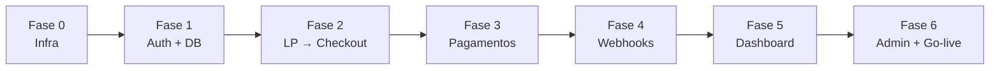

# Plano de Desenvolvimento — Sistema de Assinatura DungeonBox

> Fonte de verdade funcional: [`dungeonbox-sistema-assinatura.md`](../dungeonbox-sistema-assinatura.md)  
> Este documento organiza **o que falta**, **em que ordem** e **como validar** cada etapa.

---

## 1. Estado atual do repositório

| Área | Status | Observação |
|------|--------|------------|
| Next.js 14 + Tailwind + Framer Motion | ✅ Feito | `app/`, `components/`, `lib/data.ts` |
| Landing page editorial | ✅ Feito | Hero, planos, fidelidade, temas, FAQ, footer |
| Conteúdo estático (planos, FAQ, temas) | ✅ Feito | `lib/data.ts` — alinhar com DB na Fase 1 |
| Supabase (projeto, migrations, RLS) | ⬜ Pendente | SQL pronto em `supabase/migrations/` |
| Auth (Google, Discord, e-mail) | ⬜ Pendente | |
| Middleware de rotas protegidas | ⬜ Pendente | |
| Checkout 3 passos + Mercado Pago | ⬜ Pendente | |
| Webhooks MP | ⬜ Pendente | |
| Dashboard do assinante | ⬜ Pendente | |
| Painel admin | ⬜ Pendente | |
| E-mails transacionais | ⬜ Pendente | Resend ou similar |
| Deploy produção (Vercel + domínio) | ⬜ Pendente | |

**Gap imediato:** CTAs da LP apontam para `#planos`. Na Fase 3 passam para `/checkout?plan={slug}`.

---

## 2. Visão das fases



| Fase | Nome | Duração estimada | Bloqueia |
|------|------|------------------|----------|
| **0** | Infra e convenções | 0,5–1 dia | Tudo |
| **1** | Supabase + Auth | 2–3 dias | Checkout, dashboard |
| **2** | Ponte LP → conta | 1 dia | Checkout real |
| **3** | Checkout + Mercado Pago | 3 dias | Ativação de assinatura |
| **4** | Webhooks e ciclos | 2 dias | Dashboard confiável |
| **5** | Dashboard do usuário | 4 dias | Operação do cliente |
| **6** | Admin, e-mail, deploy | 3 dias | Go-live |
| | **Total restante** | **~15–17 dias** | |

*A Sprint 2 do doc técnico (LP) está concluída; o cronograma abaixo começa da Fase 0.*

---

## 3. Decisões técnicas (atualizar no doc v1.1)

| Tópico | Doc v1.0 | Implementação recomendada |
|--------|----------|---------------------------|
| Cliente Supabase | `@supabase/auth-helpers-nextjs` | **`@supabase/ssr`** (padrão atual Next 14 App Router) |
| Planos na LP | `lib/data.ts` | Manter estático na LP; **checkout/dashboard leem `plans` do DB** |
| Slugs dos planos | `aventureiro`, `heroi`, `lendario` | Já batem com `lib/data.ts` `id` |
| Pagamento | Brick embed ou redirect MP | **Brick** (melhor UX); redirect como fallback |
| E-mail | Resend | Conforme doc |

---

## 4. Fase 0 — Infra e convenções

### Objetivo
Preparar o monorepo para backend sem quebrar a LP.

### Entregáveis
- [ ] `.env.example` preenchido (copiar para `.env.local`)
- [ ] Projeto Supabase criado (dev + prod depois)
- [ ] Conta Mercado Pago Developers (sandbox)
- [ ] Dependências: `@supabase/ssr`, `@supabase/supabase-js`, `mercadopago`, `zod` (validação API)
- [ ] `lib/supabase/client.ts`, `server.ts`, `middleware.ts`
- [ ] `lib/mercadopago.ts` (stub até Fase 3)
- [ ] `middleware.ts` na raiz (matcher vazio até Fase 1)

### Critérios de aceite
- `npm run build` passa com novas deps
- Variáveis documentadas; nenhum secret no git

---

## 5. Fase 1 — Banco de dados + Auth

### Objetivo
Schema completo, RLS, login social e callback OAuth.

### Migrations (ordem)
Executar via Supabase CLI ou SQL Editor, na ordem numérica em `supabase/migrations/`:

1. `00001_extensions_and_enums.sql`
2. `00002_plans_loyalty_themes.sql` + seeds
3. `00003_profiles_addresses.sql` + trigger `handle_new_user` + `is_admin`
4. `00004_subscriptions.sql`
5. `00005_payments.sql`
6. `00006_subscription_cycles.sql`
7. `00007_theme_votes.sql`
8. `00008_views.sql`
9. `00009_rls_policies.sql`

### Auth (Supabase Dashboard)
- [ ] E-mail/senha + confirmação
- [ ] Google OAuth
- [ ] Discord OAuth
- [ ] URLs: `http://localhost:3000/auth/callback`, produção quando houver domínio

### App
- [ ] `app/auth/page.tsx` + `components/auth/AuthForm.tsx`
- [ ] `app/auth/callback/route.ts`
- [ ] Middleware: proteger `/dashboard/*`, `/checkout/*`, `/admin/*`
- [ ] `profiles.is_admin` para admin (seed manual do primeiro admin)

### Critérios de aceite
- Registro/login com Google, Discord e e-mail funcionam em local
- Novo usuário ganha linha em `profiles` automaticamente
- Usuário A não lê assinatura de usuário B (RLS)
- `plans` e `loyalty_levels` com seed igual ao doc

---

## 6. Fase 2 — Ponte LP → fluxo de assinatura

### Objetivo
Conectar marketing ao funil sem pagamento ainda.

### Tarefas
- [ ] `CTAButton` / planos: `href="/checkout?plan=heroi"` (slug dinâmico por plano)
- [ ] Navbar: link “Entrar” → `/auth`, “Minha conta” quando logado → `/dashboard`
- [ ] `app/checkout/page.tsx` — shell com barra de progresso (steps vazios OK)
- [ ] Middleware: checkout exige auth → redirect `/auth?next=/checkout?plan=...`

### Critérios de aceite
- Fluxo: LP → Assinar → login → volta ao checkout com `plan` preservado
- Build e lint OK

---

## 7. Fase 3 — Checkout + Mercado Pago

### Objetivo
Assinatura recorrente criada no MP e registro `pending` no Supabase.

### Componentes
| Arquivo | Responsabilidade |
|---------|------------------|
| `components/checkout/StepPlan.tsx` | Plano, cores, notas |
| `components/checkout/StepAddress.tsx` | CRUD endereço + ViaCEP |
| `components/checkout/StepPayment.tsx` | Brick MP |
| `components/checkout/MPPaymentBrick.tsx` | SDK v2 |
| `components/ui/AddressForm.tsx` | Form reutilizável |

### API
- [ ] `POST /api/subscriptions/create` — pré-aprovação MP + `subscriptions` pending
- [ ] `POST /api/payments/process` — se usar submit do Brick
- [ ] `POST /api/addresses`, `PATCH/DELETE /api/addresses/[id]`
- [ ] `app/checkout/success/page.tsx`

### Critérios de aceite
- Sandbox MP: usuário completa checkout e existe `subscriptions` com `mp_subscription_id`
- Endereço default único por usuário (índice parcial)
- CPF no perfil antes do pagamento (requisito MP)

---

## 8. Fase 4 — Webhooks e ciclo de vida

### Objetivo
MP é fonte de verdade para status; sistema atualiza ciclos e fidelidade.

### Tarefas
- [ ] `POST /api/webhooks/mercadopago` + validação `x-signature`
- [ ] Handler `subscription_preapproval` → `active` / `cancelled` / `paused`
- [ ] Handler `payment` → `payments`, `subscription_cycles`, `loyalty_level`
- [ ] Funções: `createNextCycle`, `calculateLoyaltyLevel`
- [ ] Webhook configurado no painel MP (ngrok em dev)
- [ ] Idempotência: `upsert` em `payments` por `mp_payment_id`

### Critérios de aceite
- Simulação MP: `authorized` ativa assinatura e cria ciclo 1 `upcoming`
- Pagamento `approved` incrementa `current_cycle` e nível de fidelidade
- Pagamento `rejected` → `past_due`

---

## 9. Fase 5 — Dashboard do assinante

### Objetivo
Self-service pós-compra alinhado ao visual editorial.

### Rotas
```
/dashboard                 → visão geral
/dashboard/subscription    → detalhes, pausar, cancelar
/dashboard/deliveries      → ciclos + rastreio
/dashboard/payments        → histórico
/dashboard/profile         → CPF, telefone, cor preferida
/dashboard/addresses       → CRUD
/dashboard/loyalty         → nível e benefícios
```

### Layout
- [ ] `app/dashboard/layout.tsx` + `DashboardSidebar.tsx`
- [ ] Cards: `SubscriptionStatusCard`, `NextDeliveryCard`, `LoyaltyCard`
- [ ] APIs: cancel/pause subscription, patch profile

### Critérios de aceite
- Assinante ativo vê próximo ciclo e nível de fidelidade corretos
- Cancelamento reflete no MP e no banco
- UI consistente com LP (stone-950, ember/frost, font-display)

---

## 10. Fase 6 — Admin, e-mails e go-live

### Objetivo
Operação interna e produção.

### Admin
- [ ] `/admin` KPIs (view `mrr`, `active_subscribers`)
- [ ] `/admin/subscribers` — lista e filtros
- [ ] `/admin/cycles` + `POST /api/admin/cycles/[id]/ship` (tracking)
- [ ] `/admin/themes` — CRUD temas mensais
- [ ] Rota admin só com `profiles.is_admin = true`

### E-mails (Resend)
- [ ] Boas-vindas (ativação)
- [ ] Falha de pagamento
- [ ] Box enviada (tracking)

### Deploy
- [ ] Vercel + env vars produção
- [ ] Domínio + callback OAuth produção
- [ ] Webhook MP URL produção
- [ ] Teste E2E manual documentado (checklist abaixo)

---

## 11. Mapa de arquivos (alvo)

Estrutura completa no doc técnico §11. Prioridade de criação:

```
Fase 1:  lib/supabase/*, middleware.ts, app/auth/**
Fase 2:  (ajustes em components/ui/CTAButton, PlanPanel)
Fase 3:  app/checkout/**, components/checkout/**, app/api/subscriptions/**, app/api/addresses/**
Fase 4:  app/api/webhooks/mercadopago/route.ts
Fase 5:  app/dashboard/**, components/dashboard/**
Fase 6:  app/admin/**, app/api/admin/**
```

---

## 12. Sincronização LP ↔ banco

| Campo LP (`lib/data.ts`) | Tabela `plans` | Ação |
|--------------------------|----------------|------|
| `id` | `slug` | Igual |
| `price` | `price_cents` | LP em reais; DB em centavos |
| `perks` | — | Só marketing; perks reais derivam de colunas DB |
| Temas LP | `themes` | Seed admin; LP pode migrar para fetch SSR depois |

**Recomendação:** Fase 5+ opcional — `getPlans()` server-side do Supabase na LP para preço único.

---

## 13. Checklist go-live (E2E)

1. [ ] Assinar Herói com cartão sandbox → assinatura `active`
2. [ ] Dashboard mostra plano, endereço e ciclo 1
3. [ ] Webhook de pagamento mensal simulado → ciclo avança
4. [ ] Cancelar → status `cancelled` no MP e DB
5. [ ] Admin marca ciclo como `shipped` com código Correios
6. [ ] Cliente vê rastreio em entregas
7. [ ] RLS: tentativa de acessar UUID alheio falha

---

## 14. Riscos e mitigação

| Risco | Mitigação |
|-------|-----------|
| Doc usa auth-helpers deprecado | Usar `@supabase/ssr` desde Fase 0 |
| FK `subscription_cycles` → `themes` antes de existir tema | Seed 12 temas ou `theme_id` nullable no 1º ciclo |
| Webhook em localhost | ngrok / MP test tool |
| CPF obrigatório MP | Step perfil ou Step 2 checkout |
| Dupla fonte de preço (LP vs DB) | Checkout sempre lê DB; LP atualizada manualmente até sync |

---

## 15. Próximo passo recomendado

**Começar Fase 0 + Fase 1 em sequência:**

1. `cp .env.example .env.local` e preencher Supabase
2. `npx supabase link` + `supabase db push` (migrations)
3. Configurar providers OAuth
4. Implementar auth + middleware
5. Validar login e RLS

Quando a Fase 1 estiver verde, seguir para Fase 2 (CTAs) e Fase 3 (checkout sandbox).

---

*DungeonBox · Plano de desenvolvimento · gerado a partir do doc técnico v1.0*
