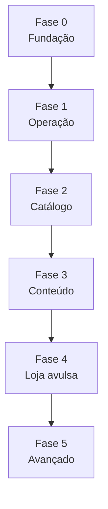

# Plano de implementação — Admin DungeonBox

> Objetivo: construir o **painel administrativo completo** (`/admin`) para operar assinaturas, clientes, produção mensal, catálogo, conteúdo, pagamentos e (futuro) loja avulsa — com segurança, auditoria e fluxos que hoje dependem de SQL/Supabase Studio.

**Fontes de verdade relacionadas:**

- [`dungeonbox-sistema-assinatura.md`](../dungeonbox-sistema-assinatura.md) — §7 Painel Administrativo
- [`PLANO-DE-DESENVOLVIMENTO.md`](PLANO-DE-DESENVOLVIMENTO.md) — Fase 6
- [`migracao-vendas-go-live.md`](migracao-vendas-go-live.md) — go-live comercial

---

## 1. Visão e princípios

### 1.1 O que o Admin resolve

| Hoje (sem admin) | Com admin |
|------------------|-----------|
| Marcar caixa enviada via SQL | Fluxo guiado: ciclo → tracking → e-mail automático |
| Cupom criado manualmente no banco | CRUD de promo codes com validação |
| Tema do mês inserido no Studio | CRUD de temas + reveal programado |
| Copy de planos espalhada em `lib/data.ts` | Gestão centralizada + sync site/checkout |
| Buscar assinante no Supabase | Busca por e-mail, CPF, ID gateway, status |
| KPIs inexistentes na UI | MRR, churn, ciclos em produção, receita |

### 1.2 Princípios de design

1. **Operação primeiro** — MVP focado em quem despacha caixas e responde clientes.
2. **Server-first** — páginas admin como Server Components; mutações via Server Actions ou API com service role controlado.
3. **Auditoria** — toda ação sensível gera log (`admin_audit_log`).
4. **Reutilizar padrões** — shell visual alinhado ao dashboard do assinante (stone/ember), componentes `DashboardCard`, `DataRow`, `StatusBadge`.
5. **Não duplicar regras** — reutilizar `lib/subscriptions/*`, `lib/email/*`, `lib/checkout/*`; admin orquestra, não reimplementa webhooks.
6. **Evolução por fases** — entregar valor operacional antes de CMS/loja avulsa completa.

### 1.3 Papéis (v1 → v2)

| Papel | v1 | v2 |
|-------|----|----|
| `is_admin = true` | Acesso total | Mantido como super-admin |
| Operador logística | — | Só ciclos + envios |
| Suporte | — | Clientes + assinaturas (read + notas) |
| Marketing | — | Copy + cupons + temas |

**v1:** apenas boolean `profiles.is_admin` (já existe + middleware pronto).

**v2:** tabela `admin_roles` ou claims JWT — fora do escopo inicial, documentado para expansão.

---

## 2. Estado atual do repositório

### 2.1 Já implementado (base para o admin)

| Item | Status |
|------|--------|
| Middleware `/admin/*` + gate `is_admin` | ✅ `middleware.ts`, `lib/supabase/middleware.ts` |
| Coluna `profiles.is_admin` | ✅ |
| Views `mrr`, `active_subscribers` | ✅ `00008_views.sql` |
| Schema operacional (subscriptions, cycles, payments, themes, promo_codes) | ✅ |
| Dashboard do assinante completo | ✅ `/dashboard/*` |
| Webhooks Asaas/Stripe + sync | ✅ |
| E-mail `notifyOrderShipped` | ✅ código existe, **não wired** |
| Checkout, upgrade, pause | ✅ |

### 2.2 Não implementado

| Item | Gap |
|------|-----|
| `app/admin/**` | Zero páginas |
| `app/api/admin/**` | Zero endpoints |
| RLS para admin | Sem policies; hoje só service role ou leitura user-scoped |
| CRUD planos/temas/cupons na UI | SQL manual |
| Produtos avulsos / pedidos one-shot | Sem tabelas `products`, `orders` |
| CMS de copy | LP usa `lib/data.ts` estático |
| Audit log | Inexistente |

### 2.3 Seed do primeiro admin

```sql
UPDATE profiles SET is_admin = true WHERE email = 'seu@email.com';
```

Ver também [`supabase/README.md`](../supabase/README.md).

---

## 3. Arquitetura proposta

### 3.1 Estrutura de pastas

```
app/
  admin/
    layout.tsx              # AdminShell + requireAdmin()
    page.tsx                # KPIs
    clientes/
      page.tsx              # Lista
      [id]/page.tsx         # Detalhe 360°
    assinaturas/
      page.tsx
      [id]/page.tsx
    ciclos/
      page.tsx              # Fila operacional (preparing)
      [id]/page.tsx
    pagamentos/page.tsx
    planos/
      page.tsx
      [id]/page.tsx         # Preço DB + copy marketing
    temas/
      page.tsx
      [id]/page.tsx
    cupons/
      page.tsx
      [id]/page.tsx
    conteudo/page.tsx       # FAQ, textos LP, e-mails (fase 3)
    avulsos/                # Fase 4
      produtos/page.tsx
      pedidos/page.tsx
    newsletter/page.tsx
    configuracoes/page.tsx
    auditoria/page.tsx
  api/admin/
    cycles/[id]/ship/route.ts
    themes/route.ts
    themes/[id]/route.ts
    promo-codes/route.ts
    ...

lib/
  admin/
    auth.ts                 # requireAdmin(), assertAdmin()
    queries.ts              # KPIs, listagens paginadas
    actions.ts              # Server actions mutáveis
    audit.ts                # logAdminAction()
    permissions.ts          # v2
    types.ts

components/
  admin/
    AdminShell.tsx
    AdminNav.tsx
    AdminHeader.tsx
    KpiCard.tsx
    DataTable.tsx
    FilterBar.tsx
    ...
```

### 3.2 Fluxo de autorização

```mermaid
flowchart LR
  REQ[Request /admin/*] --> MW[middleware.ts]
  MW --> AUTH{Usuário logado?}
  AUTH -->|Não| LOGIN[/auth?next=...]
  AUTH -->|Sim| ADMIN{is_admin?}
  ADMIN -->|Não| HOME[/]
  ADMIN -->|Sim| PAGE[Server Component]
  PAGE --> RA[requireAdmin]
  RA --> SVC[createClient ou createAdminClient]
  SVC --> DATA[Queries / Actions]
  MUT[Mutação sensível] --> AUDIT[admin_audit_log]
  MUT --> EMAIL[E-mail transacional opcional]
```

**Regra de acesso a dados:**

- **Leitura agregada (KPIs, listas):** `createClient()` + novas RLS policies `is_admin`, **ou** `createAdminClient()` encapsulado em `requireAdmin()` (mais simples no v1).
- **Mutação:** Server Action com `requireAdmin()` + `createAdminClient()` + audit log.

### 3.3 RLS — migration recomendada (Fase 0)

Adicionar helper SQL:

```sql
CREATE OR REPLACE FUNCTION public.is_admin_user()
RETURNS boolean
LANGUAGE sql
STABLE
SECURITY DEFINER
SET search_path = public
AS $$
  SELECT COALESCE(
    (SELECT is_admin FROM profiles WHERE id = auth.uid()),
    false
  );
$$;
```

Policies exemplo:

```sql
CREATE POLICY "admin read all subscriptions"
  ON subscriptions FOR SELECT
  USING (public.is_admin_user());
```

Repetir para `profiles`, `payments`, `subscription_cycles`, `promo_codes`, `themes`, etc.

Alternativa v1 mais rápida: **somente service role** em `lib/admin/*` sem RLS nova — aceitável se todas as rotas passarem por `requireAdmin()`.

---

## 4. Mapa de módulos

### 4.1 Dashboard executivo (`/admin`)

**Objetivo:** visão em 30 segundos da saúde do negócio.

**KPIs (cards):**

| Métrica | Fonte |
|---------|--------|
| MRR total | view `mrr` |
| Assinantes ativos | `active_subscribers` ou `count(*)` status active |
| Novos assinantes (7d / 30d) | `subscriptions.started_at` |
| Cancelamentos (30d) | `status = cancelled`, `cancelled_at` |
| Ciclos em preparação | `subscription_cycles.status = preparing` |
| Pagamentos aprovados (30d) | `payments` |
| Taxa past_due | `subscriptions.status = past_due` |
| Ticket médio | derivado de MRR / assinantes |

**Widgets:**

- Gráfico MRR por plano (barra)
- Últimos 10 pagamentos
- Fila “enviar hoje” (ciclos preparing sem tracking)
- Alertas: webhooks falhando, assinaturas pending > 24h

**Arquivos:** `app/admin/page.tsx`, `lib/admin/queries.ts` → `getAdminDashboardStats()`

---

### 4.2 Clientes (`/admin/clientes`)

**Objetivo:** CRM operacional — não substituir HubSpot, mas centralizar dado do assinante.

**Lista:**

- Busca: e-mail, nome, CPF, telefone
- Filtros: tem assinatura ativa, newsletter, data cadastro
- Colunas: nome, e-mail, planos ativos, status, membro desde

**Detalhe `[id]`:**

| Seção | Dados |
|-------|--------|
| Perfil | `profiles` + link auth user id |
| Endereços | `addresses` |
| Assinaturas | todas, com gateway ids |
| Pagamentos | histórico |
| Ciclos / entregas | timeline |
| Ações admin | nota interna, togglar `is_admin` (super), reenviar e-mail |

**Ações v1:**

- Editar campos de perfil (suporte)
- Adicionar **nota interna** (nova coluna `profiles.admin_notes` ou tabela `customer_notes`)

**Ações v2:**

- Mesclar contas duplicadas
- Export CSV

---

### 4.3 Assinaturas (`/admin/assinaturas`)

**Objetivo:** gestão completa do lifecycle além do que o cliente vê.

**Lista:**

- Filtros: status, plano, gateway (Asaas/Stripe/MP), promo, região frete
- Bulk export para logística

**Detalhe `[id]`:**

- Plano atual + `pending_plan_id` (upgrade agendado)
- IDs: `asaas_subscription_id`, `stripe_subscription_id`
- Ciclo atual, próxima cobrança, loyalty
- Endereço de entrega
- Observações do checkout (`special_notes`)
- Timeline de pagamentos e ciclos

**Ações admin (com confirmação + audit):**

| Ação | Uso |
|------|-----|
| Forçar status local | Correção rara pós-webhook |
| Sincronizar com Asaas | Re-fetch payments (`syncAsaasSubscriptionPayments`) |
| Cancelar / pausar / retomar | Reutilizar lógica de `app/dashboard/actions.ts` |
| Reconciliar pending | Botão “reprocessar pagamento” |
| Alterar endereço do ciclo | Antes de `shipped` |

**Cuidado:** ações que alteram gateway devem chamar APIs existentes em `lib/asaas/subscription-api.ts` e equivalentes Stripe.

---

### 4.4 Ciclos e pedidos mensais (`/admin/ciclos`)

> No domínio atual, **“pedido” de assinatura = `subscription_cycles`** (caixa do mês). Pedidos avulsos são módulo separado (§4.10).

**Objetivo:** fila de produção e expedição.

**Lista (default: `status = preparing`):**

- Assinante, plano, tema do ciclo, endereço, ciclo #
- Indicador: pagamento do ciclo aprovado?
- Ações em lote: export CSV Correios / Melhor Envio

**Detalhe + ação principal — Enviar:**

```
POST /api/admin/cycles/[id]/ship
Body: { tracking_code, carrier?, shipped_at? }
```

**Efeitos:**

1. Update `subscription_cycles`: `status = shipped`, tracking, dates
2. Chamar `notifyOrderShipped()` (`lib/email/ship-notify.ts`)
3. Audit log

**Outros status:**

- `delivered` (manual ou integração transportadora futura)
- `failed` (problema produção)

**Integração futura:** Melhor Envio / Correios API para gerar etiqueta.

---

### 4.5 Pagamentos (`/admin/pagamentos`)

**Lista:**

- Filtros: status, provider, período, valor
- Colunas: data, cliente, assinatura, valor, status, id gateway

**Detalhe:**

- Payload raw (`mp_raw_payload` se MP)
- Link para assinatura e ciclo (`payment_id` em cycles)

**Ações v2:**

- Registrar estorno manual
- Reconciliar pagamento órfão

---

### 4.6 Planos e cópias (`/admin/planos`)

**Duas camadas:**

| Camada | Onde | Admin edita |
|--------|------|-------------|
| **Plano comercial** | tabela `plans` | preço, peças, frete, desconto loja, flags, `is_active`, `sort_order` |
| **Copy marketing** | hoje `lib/data.ts` | tagline, perks, specs, CTA, imagens |

**Problema atual:** checkout lê `plans` do DB; LP lê `lib/data.ts`. Admin deve **unificar**.

**Solução proposta (Fase 3):**

Nova tabela `plan_marketing_content`:

```sql
CREATE TABLE plan_marketing_content (
  plan_id uuid PRIMARY KEY REFERENCES plans(id) ON DELETE CASCADE,
  tagline text,
  pieces_label text,
  specs jsonb DEFAULT '[]',
  perks jsonb DEFAULT '[]',
  delivery_items jsonb DEFAULT '[]',
  cta_text text,
  image_path text,
  billing_note text,
  updated_at timestamptz DEFAULT now()
);
```

**UI `/admin/planos/[id]`:**

- Aba **Comercial** — preço, frete, ativo
- Aba **Site** — copy, preview ao vivo
- Aba **Checkout** — descrição fatura Asaas

**Sync:** LP e componentes passam a ler DB (com cache ISR) em vez de `lib/data.ts`.

---

### 4.7 Temas mensais (`/admin/temas`)

CRUD sobre tabela `themes`:

| Campo | Uso |
|-------|-----|
| `month_number`, `year` | Chave do mês |
| `name`, `slug`, `lore`, `emoji` | Identidade |
| `image_url` | Arte |
| `is_active`, `is_revealed` | Visível no site / votação |

**Fluxo operacional:**

1. Criar tema do próximo mês (draft)
2. Associar a ciclos `upcoming` (job ou manual)
3. `is_revealed = true` na data de reveal

**API:**

- `GET/POST /api/admin/themes`
- `PATCH /api/admin/themes/[id]`
- `DELETE` soft (desativar)

**Futuro:** integrar `theme_votes` + `theme_options` (hoje schema órfão).

---

### 4.8 Cupons (`/admin/cupons`)

CRUD `promo_codes` + visualização `promo_code_redemptions`:

| Campo | UI |
|-------|-----|
| `code`, `discount_type`, `discount_value` | form |
| `plan_slugs[]`, `max_redemptions`, `expires_at`, `active` | form |
| `times_redeemed` | read-only |

Validações espelham `lib/checkout/promo-codes.ts`.

**Ações:**

- Criar / editar / desativar
- Ver quem resgatou
- Duplicar cupom

---

### 4.9 Fidelidade (`/admin/fidelidade`)

Leitura + edição de `loyalty_levels`:

- Nome, `min_cycles`, bônus, desconto, flags voto/exclusivo
- Recalcular nível de um assinante (botão debug)

**Cuidado:** alterar regras não retroage automaticamente — documentar comportamento.

---

### 4.10 Itens avulsos e pedidos (`/admin/avulsos`) — Fase 4

**Hoje:** bumps de pintura hardcoded em `lib/checkout/order-bumps.ts`; sem loja.

**Schema proposto:**

```sql
CREATE TABLE products (
  id uuid PRIMARY KEY DEFAULT gen_random_uuid(),
  slug text UNIQUE NOT NULL,
  name text NOT NULL,
  description text,
  price_cents int NOT NULL,
  product_type text NOT NULL, -- 'one_time' | 'addon_subscription'
  is_active boolean DEFAULT true,
  metadata jsonb DEFAULT '{}',
  sort_order int DEFAULT 0,
  created_at timestamptz DEFAULT now()
);

CREATE TABLE orders (
  id uuid PRIMARY KEY DEFAULT gen_random_uuid(),
  user_id uuid REFERENCES profiles(id),
  status text NOT NULL, -- pending, paid, shipped, cancelled
  total_cents int NOT NULL,
  payment_id uuid REFERENCES payments(id),
  shipping_address_id uuid REFERENCES addresses(id),
  created_at timestamptz DEFAULT now()
);

CREATE TABLE order_items (
  id uuid PRIMARY KEY DEFAULT gen_random_uuid(),
  order_id uuid REFERENCES orders(id) ON DELETE CASCADE,
  product_id uuid REFERENCES products(id),
  quantity int DEFAULT 1,
  unit_price_cents int NOT NULL
);
```

**Admin:**

- CRUD produtos (tiles avulsos, kits pintura, merch)
- Lista pedidos avulsos + status envio
- Vincular pagamento Asaas one-time existente

**Integração checkout:** migrar `PAINT_KIT_BUMPS` → `products` seed.

---

### 4.11 Conteúdo e copy global (`/admin/conteudo`) — Fase 3

Centralizar textos hoje espalhados:

| Bloco | Origem atual | Destino |
|-------|--------------|---------|
| FAQ site | `lib/data.ts` → `faqItems` | tabela `site_faq` ou JSON em `site_content` |
| FAQ pré-launch | `lib/launch/data.ts` | arquivar pós go-live |
| Textos planos | `lib/data.ts` | `plan_marketing_content` |
| E-mails transacionais | `lib/email/templates/*` | preview + variáveis (edição v2) |
| Order bump copy | `order-bumps.ts` | `products.description` |

**Tabela genérica (alternativa):**

```sql
CREATE TABLE site_content (
  key text PRIMARY KEY,
  locale text DEFAULT 'pt-BR',
  body jsonb NOT NULL,
  updated_at timestamptz DEFAULT now(),
  updated_by uuid REFERENCES profiles(id)
);
```

---

### 4.12 Newsletter / waitlist (`/admin/newsletter`)

Leitura de `newsletter_leads`:

- Lista, export CSV, fonte (`source`)
- Métricas de captura (pré-launch)

**Ação:** migrar leads quentes para campanha (manual v1).

---

### 4.13 Configurações (`/admin/configuracoes`)

| Config | Onde vive hoje |
|--------|----------------|
| Provedor pagamento | env `PAYMENT_PROVIDER` |
| Asaas env | env |
| Cupons habilitados | `NEXT_PUBLIC_CHECKOUT_COUPONS_ENABLED` |
| Feature flags | env / futura tabela `app_settings` |
| Frete regiões | `lib/shipping/rates.ts` |

**v1:** painel read-only mostrando env seguro (mascarado).

**v2:** tabela `app_settings` editável + cache.

---

### 4.14 Auditoria (`/admin/auditoria`)

```sql
CREATE TABLE admin_audit_log (
  id uuid PRIMARY KEY DEFAULT gen_random_uuid(),
  actor_id uuid REFERENCES profiles(id),
  action text NOT NULL,
  entity_type text NOT NULL,
  entity_id text,
  metadata jsonb DEFAULT '{}',
  ip_address text,
  created_at timestamptz DEFAULT now()
);

CREATE INDEX idx_audit_created ON admin_audit_log(created_at DESC);
CREATE INDEX idx_audit_entity ON admin_audit_log(entity_type, entity_id);
```

Registrar: ship cycle, edit plan price, create coupon, force status, etc.

---

## 5. UI/UX do Admin

### 5.1 Shell

- Reutilizar linguagem visual: `bg-stone-950`, `ember`, `DashboardCard`
- `AdminNav` lateral (desktop) + drawer (mobile)
- Badge “Admin” no header
- Link rápido “Ver como cliente” → `/dashboard`

### 5.2 Padrões de componente

| Componente | Uso |
|------------|-----|
| `DataTable` | listas paginadas |
| `FilterBar` | status, datas, busca |
| `KpiCard` | dashboard |
| `StatusBadge` | reutilizar do dashboard |
| `ConfirmDialog` | ações destrutivas |
| `EmptyState` | reutilizar |

### 5.3 Navegação sugerida

```
Dashboard
Clientes
Assinaturas
Ciclos / Envios
Pagamentos
Planos & Copy
Temas
Cupons
Avulsos (fase 4)
Newsletter
Auditoria
Configurações
```

---

## 6. APIs Admin — mapa completo

### Fase 1 (operacional)

| Método | Rota | Descrição |
|--------|------|-----------|
| GET | `/api/admin/stats` | KPIs JSON (opcional; pode ser server-only) |
| GET | `/api/admin/subscribers` | Lista paginada |
| GET | `/api/admin/subscribers/[id]` | Detalhe |
| POST | `/api/admin/cycles/[id]/ship` | Marcar enviado + e-mail |
| PATCH | `/api/admin/cycles/[id]` | Status delivered/failed |
| GET | `/api/admin/payments` | Lista filtrada |

### Fase 2 (catálogo)

| Método | Rota | Descrição |
|--------|------|-----------|
| GET/POST | `/api/admin/themes` | CRUD temas |
| PATCH/DELETE | `/api/admin/themes/[id]` | |
| GET/POST | `/api/admin/promo-codes` | CRUD cupons |
| PATCH | `/api/admin/plans/[id]` | Preço e flags |
| POST | `/api/admin/subscriptions/[id]/sync` | Re-sync gateway |

### Fase 3–4

| Método | Rota | Descrição |
|--------|------|-----------|
| PATCH | `/api/admin/plans/[id]/content` | Copy marketing |
| GET/POST | `/api/admin/products` | Avulsos |
| GET | `/api/admin/orders` | Pedidos avulsos |

Todas as rotas: **401** sem auth, **403** sem `is_admin`.

---

## 7. Fases de implementação



### Fase 0 — Fundação (3–5 dias)

**Entregáveis:**

- [ ] `lib/admin/auth.ts` — `requireAdmin()`
- [ ] `lib/admin/audit.ts` + migration `admin_audit_log`
- [ ] `AdminShell`, `AdminNav`, `app/admin/layout.tsx`
- [ ] Página placeholder `/admin` (“em construção”)
- [ ] Migration RLS admin **ou** policy documentada de service-role-only
- [ ] Teste: user comum → redirect `/`; admin → acessa

**Critério de aceite:** rota `/admin` acessível só por admin com layout consistente.

---

### Fase 1 — Operação diária (1–2 semanas)

**Prioridade máxima — desbloqueia logística:**

- [ ] Dashboard KPIs (`mrr`, assinantes, fila preparing)
- [ ] `/admin/clientes` — lista + detalhe read-only
- [ ] `/admin/assinaturas` — lista + detalhe + sync Asaas
- [ ] `/admin/ciclos` — fila preparing
- [ ] `POST /api/admin/cycles/[id]/ship` + wire `notifyOrderShipped`
- [ ] `/admin/pagamentos` — lista read-only

**Critério de aceite:** marcar ciclo enviado dispara e-mail e aparece tracking no dashboard do cliente.

---

### Fase 2 — Catálogo e promoções (1 semana)

- [ ] CRUD temas (`/admin/temas`)
- [ ] CRUD cupons (`/admin/cupons`)
- [ ] Edição plano comercial (preço, ativo, frete) — **sem copy ainda**
- [ ] Ações assinatura admin (cancel/pause com audit)

**Critério de aceite:** criar cupom no admin → funciona no checkout sem SQL.

---

### Fase 3 — Conteúdo unificado (1–2 semanas)

- [ ] Migration `plan_marketing_content` + `site_content`
- [ ] UI copy por plano + FAQ
- [ ] Refator LP/checkout para ler DB (fallback `lib/data.ts` durante transição)
- [ ] Preview de alterações

**Critério de aceite:** editar tagline do Herói no admin → reflete na home após deploy/revalidate.

---

### Fase 4 — Loja avulsos (2–3 semanas)

- [ ] Migrations `products`, `orders`, `order_items`
- [ ] Migrar order bumps para `products`
- [ ] Admin produtos + pedidos
- [ ] Checkout one-shot (ou bump dinâmico)

**Critério de aceite:** kit pintura gerenciável no admin; pedido avulso rastreável.

---

### Fase 5 — Avançado (backlog)

- [ ] RBAC (`admin_roles`)
- [ ] Export CSV / integração Correios
- [ ] Dashboard churn e cohort
- [ ] Votação temas (`theme_votes`)
- [ ] Webhook health monitor
- [ ] Edição templates e-mail
- [ ] Automação: ciclo `upcoming` → `preparing` no pagamento confirmado (já parcial no webhook)

---

## 8. Dependências e riscos

| Risco | Mitigação |
|-------|-----------|
| Admin bypass RLS via service role | Sempre `requireAdmin()` + audit |
| Editar preço plano dessincroniza Asaas | Aviso UI; assinaturas existentes mantêm valor até upgrade |
| Copy DB vs `lib/data.ts` duplicado | Fase 3 com feature flag `CONTENT_FROM_DB` |
| Ship API sem idempotência | Upsert tracking; ignorar re-ship igual |
| MP legacy | Admin mostra provider; priorizar Asaas |

---

## 9. Checklist de go-live do Admin

- [ ] Pelo menos 1 admin seed em produção
- [ ] Fase 1 completa (ship + KPIs)
- [ ] Audit log ativo
- [ ] Teste e2e: ciclo preparing → ship → e-mail → tracking no `/dashboard/deliveries`
- [ ] Documentar runbook operacional mensal (criar tema → produzir → ship em lote)

---

## 10. Runbook operacional mensal (referência)

1. **Tema** — cadastrar/revelar em `/admin/temas`
2. **Ciclos** — conferir fila `preparing` após cobrança (webhook)
3. **Produção** — export endereços / picking list
4. **Envio** — inserir tracking em lote; e-mails automáticos
5. **Exceções** — assinaturas `past_due` via `/admin/assinaturas`
6. **Cupom campanha** — criar em `/admin/cupons` se necessário

---

## 11. Estimativa consolidada

| Fase | Escopo | Esforço estimado |
|------|--------|------------------|
| 0 | Fundação | 3–5 dias |
| 1 | Operação | 1–2 semanas |
| 2 | Catálogo | ~1 semana |
| 3 | Conteúdo | 1–2 semanas |
| 4 | Avulsos | 2–3 semanas |
| 5 | Avançado | contínuo |

**MVP operacional (Fase 0 + 1):** ~2 semanas para equipe pequena com foco.

---

## 12. Próximo passo recomendado

Começar **Fase 0 + Fase 1** no mesmo sprint:

1. Scaffold `app/admin/layout.tsx` + `requireAdmin`
2. Dashboard KPIs
3. Fila de ciclos + **ship API** (maior ROI imediato)

Isso elimina dependência de Supabase Studio para a operação recorrente do negócio.
