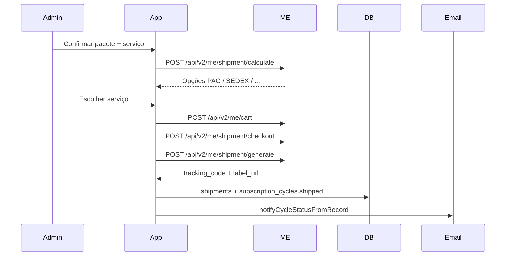

# Integração Melhor Envio — Despacho operacional (MVP)

> Objetivo: permitir que o operador **despache ciclos de assinatura direto do admin** (`/admin/ciclos`), enviando destinatário + conteúdo do pacote + dimensões/peso para o Melhor Envio, **sem cadastrar pedido manualmente no site da ME**.

**Escopo deste MVP:** apenas fluxo operacional no painel de produção. Checkout do cliente continua com tabela fixa de frete por região (`lib/shipping/rates.ts`).

**Fontes de verdade relacionadas:**

- [`admin-plano-implementacao.md`](admin-plano-implementacao.md) — §6 Ciclos / envios
- [`dungeonbox-sistema-assinatura.md`](../dungeonbox-sistema-assinatura.md) — fluxo de assinatura
- [Documentação API Melhor Envio](https://docs.melhorenvio.com.br)

---

## 1. Visão e princípios

### 1.1 O que resolve

| Hoje | Com integração ME |
|------|-------------------|
| Operador copia endereço e dados para o site do Melhor Envio | Um clique no admin cria o envio na ME |
| Rastreio digitado manualmente em `CycleShipForm` | `tracking_code` preenchido automaticamente pela API |
| Sem registro do custo real do frete | `shipments.postage_cents` guarda o valor pago na ME |
| Sem PDF de etiqueta no sistema | Link de impressão retornado após gerar etiqueta |

### 1.2 O que fica fora do MVP

- Cotação de frete no checkout (cliente)
- Webhooks automáticos de entrega (`delivered_at`)
- Envio em lote (N ciclos de uma vez)
- Pedidos avulsos standalone da loja (`payments` com `shippingMode: 'standalone'`)
- Conciliação financeira frete cobrado vs custo ME

### 1.3 Princípios

1. **Operação primeiro** — integrar no fluxo existente de `subscription_cycles` em status `preparing`.
2. **Fallback manual** — manter `CycleShipForm` atual se a ME falhar ou estiver desconectada.
3. **Um remetente** — DungeonBox usa conta ME única; destinatário vem do ciclo/assinatura.
4. **Reutilizar dados** — não duplicar endereço nem checklist; mapear de `AdminCycleDetailView` e `cycle-shipment-items.ts`.
5. **Sandbox antes de produção** — testar todo o fluxo em `sandbox.melhorenvio.com.br`.

---

## 2. Estado atual do repositório

### 2.1 Dados já disponíveis

| Dado | Origem no código |
|------|------------------|
| Nome, e-mail, telefone, CPF do cliente | `profiles` via `getAdminCycleDetail` |
| Endereço de entrega | `addresses` → `AdminCycleDetailView.orderAddress` |
| Conteúdo do pacote | `productionChecklist` / `shipmentItems` (`lib/admin/cycle-shipment-items.ts`) |
| Plano, tema, peças | `subscriptions` + `plans` + `themes` |
| Status do ciclo | `subscription_cycles.status` (`preparing` → `shipped`) |

### 2.2 O que falta

| Gap | Solução |
|-----|---------|
| Peso e dimensões do pacote | Presets por plano + override opcional no ciclo |
| Dados do remetente | Env vars ou tabela de config |
| Token OAuth Melhor Envio | Tabela `melhor_envio_tokens` + fluxo connect |
| Registro de envio ME | Tabela `shipments` |
| Client HTTP da API ME | `lib/melhor-envio/*` |
| UI de despacho | `CycleMelhorEnvioShipPanel` no modal de envio |

### 2.3 Arquivos relevantes hoje

| Área | Caminho |
|------|---------|
| Kanban produção | `app/admin/ciclos/page.tsx`, `components/admin/ProductionWorkspace.tsx` |
| Modal de envio | `components/admin/CycleShipModal.tsx`, `CycleShipForm.tsx` |
| Painel do ciclo | `components/admin/CycleProductionPanel.tsx` |
| Action de ship manual | `lib/admin/actions.ts` → `shipSubscriptionCycleAction` |
| API ship manual | `app/api/admin/cycles/[id]/ship/route.ts` |
| Itens do pacote | `lib/admin/cycle-shipment-items.ts` |
| Detalhe do ciclo | `lib/admin/cycle-detail-view.ts` |
| E-mail ao enviar | `lib/email/cycle-status-notify.ts` |
| Endereços (schema) | `supabase/migrations/00003_profiles_addresses.sql` |
| Ciclos (schema) | `supabase/migrations/00006_subscription_cycles.sql` |

---

## 3. Fluxo Melhor Envio (API)

### 3.1 Sequência de chamadas



### 3.2 Payload mínimo (`POST /api/v2/me/cart`)

```json
{
  "service": 1,
  "from": {
    "name": "DungeonBox",
    "phone": "11999999999",
    "email": "contato@dungeonbox.com.br",
    "document": "00000000000",
    "company_document": "00000000000100",
    "address": "Rua Exemplo",
    "number": "100",
    "district": "Centro",
    "city": "São Paulo",
    "state_abbr": "SP",
    "postal_code": "01001000"
  },
  "to": {
    "name": "Maria Silva",
    "phone": "11988887777",
    "email": "maria@email.com",
    "document": "12345678900",
    "address": "Rua do Cliente",
    "number": "123",
    "complement": "Apto 4",
    "district": "Jardins",
    "city": "São Paulo",
    "state_abbr": "SP",
    "postal_code": "01400000"
  },
  "products": [
    {
      "name": "Caixa Herói — Tema Taverna Sombria",
      "quantity": 1,
      "unitary_value": 89.90
    }
  ],
  "volumes": [
    {
      "height": 15,
      "width": 25,
      "length": 30,
      "weight": 1.2
    }
  ],
  "options": {
    "insurance_value": 89.90,
    "receipt": false,
    "own_hand": false
  }
}
```

### 3.3 Observações da API

- `products` é obrigatório (integração SEFAZ / DCe).
- `volumes`: dimensões em **cm**, peso em **kg**.
- Para **Correios** (services 1, 2, 17): apenas **1 volume por etiqueta**; múltiplos pacotes exigem N envios separados.
- Token OAuth expira em **30 dias**; usar `refresh_token` (45 dias) antes de expirar.
- URLs base: produção `https://melhorenvio.com.br`, sandbox `https://sandbox.melhorenvio.com.br`.

---

## 4. Modelo de dados

### 4.1 Migration: campos de pacote no ciclo

Adicionar em `subscription_cycles` (override opcional por envio):

```sql
ALTER TABLE subscription_cycles
  ADD COLUMN IF NOT EXISTS parcel_weight_kg numeric(6,3),
  ADD COLUMN IF NOT EXISTS parcel_height_cm smallint,
  ADD COLUMN IF NOT EXISTS parcel_width_cm smallint,
  ADD COLUMN IF NOT EXISTS parcel_length_cm smallint;
```

### 4.2 Migration: tabela `shipments`

```sql
CREATE TABLE shipments (
  id                    uuid PRIMARY KEY DEFAULT gen_random_uuid(),
  subscription_cycle_id uuid NOT NULL REFERENCES subscription_cycles(id) ON DELETE CASCADE,
  melhor_envio_order_id text,
  melhor_envio_protocol text,
  service_id            int,
  service_name          text,
  carrier               text,
  tracking_code         text,
  label_url             text,
  postage_cents         int,
  weight_kg             numeric(6,3),
  dimensions            jsonb,  -- { height, width, length } em cm
  status                text NOT NULL DEFAULT 'draft'
    CHECK (status IN ('draft', 'purchased', 'posted', 'delivered', 'cancelled', 'failed')),
  error_message         text,
  raw_response          jsonb,
  purchased_at          timestamptz,
  posted_at             timestamptz,
  delivered_at          timestamptz,
  created_at            timestamptz DEFAULT now(),
  updated_at            timestamptz DEFAULT now()
);

CREATE UNIQUE INDEX shipments_one_active_per_cycle
  ON shipments (subscription_cycle_id)
  WHERE status IN ('draft', 'purchased', 'posted');

CREATE INDEX shipments_tracking_code_idx ON shipments (tracking_code);
CREATE INDEX shipments_melhor_envio_order_id_idx ON shipments (melhor_envio_order_id);
```

RLS: apenas admins (service role nas rotas admin).

### 4.3 Migration: tokens OAuth

```sql
CREATE TABLE melhor_envio_tokens (
  id            uuid PRIMARY KEY DEFAULT gen_random_uuid(),
  access_token  text NOT NULL,
  refresh_token text NOT NULL,
  expires_at    timestamptz NOT NULL,
  scope         text,
  created_at    timestamptz DEFAULT now(),
  updated_at    timestamptz DEFAULT now()
);
```

Uma única linha ativa (conta ME da empresa). Criptografar tokens em repouso se possível.

### 4.4 Presets de pacote por plano (código)

Arquivo `lib/shipping/parcel-presets.ts` — valores iniciais a **medir nas caixas reais**:

```typescript
export const PLAN_PARCEL_PRESETS: Record<string, {
  weightKg: number;
  heightCm: number;
  widthCm: number;
  lengthCm: number;
}> = {
  aventureiro: { weightKg: 0.8, heightCm: 12, widthCm: 22, lengthCm: 28 },
  heroi:       { weightKg: 1.2, heightCm: 15, widthCm: 25, lengthCm: 30 },
  lendario:    { weightKg: 1.8, heightCm: 18, widthCm: 28, lengthCm: 35 },
};
```

Resolver preset pelo `plan.slug` do ciclo; se o operador alterar na UI, persistir override nos campos `parcel_*` do ciclo.

---

## 5. Configuração e variáveis de ambiente

### 5.1 Pré-requisitos (negócio)

1. Conta no [Melhor Envio](https://melhorenvio.com.br) e no [sandbox](https://sandbox.melhorenvio.com.br).
2. App OAuth em **Integrações → Área Dev** com scopes:
   - `cart-read`, `cart-write`
   - `orders-read`, `orders-write`
   - `shipping-calculate`, `shipping-generate`, `shipping-tracking`
3. `redirect_uri`: `https://<dominio>/api/integrations/melhor-envio/callback`
4. Carteira ME com saldo (produção) para `shipment/checkout`.
5. Medir peso e dimensões reais das caixas por plano.

### 5.2 `.env` (adicionar em `.env.example`)

```bash
# Melhor Envio
MELHOR_ENVIO_CLIENT_ID=
MELHOR_ENVIO_CLIENT_SECRET=
MELHOR_ENVIO_REDIRECT_URI=https://localhost:3000/api/integrations/melhor-envio/callback
MELHOR_ENVIO_SANDBOX=true

# Remetente (DungeonBox)
MELHOR_ENVIO_ORIGIN_NAME=DungeonBox
MELHOR_ENVIO_ORIGIN_EMAIL=contato@dungeonbox.com.br
MELHOR_ENVIO_ORIGIN_PHONE=5511999999999
MELHOR_ENVIO_ORIGIN_DOCUMENT=00000000000
MELHOR_ENVIO_ORIGIN_COMPANY_DOCUMENT=00000000000100
MELHOR_ENVIO_ORIGIN_STREET=Rua Exemplo
MELHOR_ENVIO_ORIGIN_NUMBER=100
MELHOR_ENVIO_ORIGIN_COMPLEMENT=
MELHOR_ENVIO_ORIGIN_DISTRICT=Centro
MELHOR_ENVIO_ORIGIN_CITY=São Paulo
MELHOR_ENVIO_ORIGIN_STATE=SP
MELHOR_ENVIO_ORIGIN_POSTAL_CODE=01001000
```

---

## 6. Implementação por fases

### Fase 1 — Infraestrutura (3–5 dias)

**Entregáveis:**

| Item | Descrição |
|------|-----------|
| Migrations | `shipments`, `melhor_envio_tokens`, campos `parcel_*` em `subscription_cycles` |
| `lib/melhor-envio/client.ts` | Fetch wrapper com base URL sandbox/prod, headers `Authorization: Bearer` |
| `lib/melhor-envio/auth.ts` | OAuth connect, callback, refresh automático |
| `lib/melhor-envio/types.ts` | Tipos da API |
| `lib/shipping/parcel-presets.ts` | Presets por plano |
| Rotas OAuth | `GET /api/admin/integrations/melhor-envio/connect`, `GET /api/integrations/melhor-envio/callback` |
| UI config | `/admin/configuracoes/integracoes` — status Conectado / Desconectado |

**Critério de aceite:** token salvo, refresh funciona, `GET /api/v2/me/shipment/services` retorna transportadoras.

---

### Fase 2 — Mapeamento ciclo → payload ME (2–3 dias)

**Entregáveis:**

| Item | Descrição |
|------|-----------|
| `lib/melhor-envio/normalize-address.ts` | `addresses` + `profiles` → formato `to` da ME |
| `lib/melhor-envio/build-origin.ts` | Env vars → formato `from` |
| `lib/melhor-envio/build-shipment-payload.ts` | `AdminCycleDetailView` + checklist + parcel → payload cart |
| `lib/melhor-envio/quote.ts` | `POST /api/v2/me/shipment/calculate` |
| Validações | CEP, CPF, telefone, endereço completo antes de cotar |

**Mapeamento de produtos:**

- Item principal: `Caixa {planName}` + tema no `name`, valor = `amount_cents` do ciclo.
- Add-ons: cada item de `productionChecklist` com `kind !== 'subscription'`.
- `unitary_value` em reais (ME espera decimal, não centavos).

**Critério de aceite:** função pura gera payload válido para um ciclo de teste no sandbox.

---

### Fase 3 — API admin quote + ship (2–3 dias)

**Rotas:**

| Método | Rota | Função |
|--------|------|--------|
| `POST` | `/api/admin/cycles/[id]/melhor-envio/quote` | Cotação; body opcional: override de `volumes` |
| `POST` | `/api/admin/cycles/[id]/melhor-envio/ship` | Body: `serviceId`, `volumes?`; executa cart → checkout → generate |

**Fluxo `ship`:**

1. `requireAdmin()` + ciclo em `preparing`.
2. Validar ME conectado e saldo (se API expuser).
3. `build-shipment-payload` + `serviceId`.
4. `POST /cart` → salvar `melhor_envio_order_id` em `shipments`.
5. `POST /shipment/checkout` com `{ orders: [orderId] }`.
6. `POST /shipment/generate` → obter `tracking` e URL da etiqueta.
7. Atualizar `subscription_cycles`: `status = shipped`, `tracking_code`, `carrier`, `shipped_at`.
8. Persistir `parcel_*` no ciclo se enviados no body.
9. `notifyCycleStatusFromRecord` (reutilizar fluxo existente).
10. `logAdminAction` com `action: 'cycle.ship_melhor_envio'`.

**Idempotência:** se já existir `shipment` com `status = purchased` para o ciclo, retornar dados existentes em vez de criar duplicata.

**Critério de aceite:** ciclo em `preparing` vira `shipped` com tracking real do sandbox.

---

### Fase 4 — UI no admin (2–3 dias)

**Componente:** `components/admin/CycleMelhorEnvioShipPanel.tsx`

Integrar em `CycleShipModal` e `CycleProductionPanel` (status `preparing`).

**Layout sugerido:**

```
┌─────────────────────────────────────────────┐
│ Destinatário (somente leitura)              │
│ Nome · Endereço · CEP · Cidade/UF           │
├─────────────────────────────────────────────┤
│ Conteúdo do pacote (somente leitura)        │
│ Lista productionChecklist                   │
├─────────────────────────────────────────────┤
│ Pacote                                      │
│ Peso (kg) · Altura · Largura · Comprimento  │
│ (pré-preenchido pelo plano, editável)       │
├─────────────────────────────────────────────┤
│ Transportadora (após cotar)                 │
│ ○ PAC — R$ X · prazo                        │
│ ○ SEDEX — R$ Y · prazo                      │
├─────────────────────────────────────────────┤
│ [Cotar frete]  [Gerar etiqueta ME]          │
│ Link "Imprimir etiqueta" após sucesso       │
│                                             │
│ ▼ Registrar rastreio manual (fallback)      │
│   CycleShipForm existente                   │
└─────────────────────────────────────────────┘
```

**Estados da UI:**

- ME desconectado → aviso + link para `/admin/configuracoes/integracoes`.
- Dados incompletos (sem CPF, CEP inválido) → bloquear cotação com mensagem clara.
- Cotando / gerando → loading + desabilitar botões.
- Sucesso → mostrar tracking, link PDF, fechar modal e refresh do Kanban.
- Erro ME → exibir mensagem da API; manter fallback manual visível.

**Critério de aceite:** operador despacha um ciclo em ≤ 4 cliques sem abrir o site da ME.

---

### Fase 5 — Testes e go-live (1–2 dias)

**Checklist sandbox:**

- [ ] OAuth connect / disconnect
- [ ] Cotação para CEPs de cada macro-região (Sul, Norte, etc.)
- [ ] Gerar etiqueta de teste
- [ ] E-mail de rastreio com código correto
- [ ] `/dashboard/deliveries` exibe tracking
- [ ] Fallback manual continua funcionando
- [ ] Token refresh após expiração simulada
- [ ] Idempotência: segundo clique em "Gerar" não duplica envio

**Checklist produção:**

- [ ] `MELHOR_ENVIO_SANDBOX=false`
- [ ] Carteira ME com saldo
- [ ] Impressora testada com PDF da etiqueta
- [ ] Monitoramento de erros (logs / Sentry)

---

## 7. Estrutura de arquivos (novos)

```
lib/melhor-envio/
  auth.ts
  build-origin.ts
  build-shipment-payload.ts
  cart.ts
  checkout.ts
  client.ts
  normalize-address.ts
  quote.ts
  types.ts

lib/shipping/
  parcel-presets.ts          # novo

app/api/admin/cycles/[id]/melhor-envio/
  quote/route.ts
  ship/route.ts

app/api/admin/integrations/melhor-envio/
  connect/route.ts

app/api/integrations/melhor-envio/
  callback/route.ts

app/admin/configuracoes/
  integracoes/page.tsx       # opcional no MVP; pode ser só env vars

components/admin/
  CycleMelhorEnvioShipPanel.tsx

supabase/migrations/
  YYYYMMDD_melhor_envio_shipments.sql
```

---

## 8. Validações obrigatórias antes de despachar

| Campo | Regra |
|-------|-------|
| Ciclo | `status === 'preparing'` |
| Destinatário | `recipient`, `street`, `number`, `neighborhood`, `city`, `state`, `zip_code` |
| CPF | `profiles.cpf` presente e válido |
| Telefone | `profiles.phone` presente |
| Pacote | peso > 0; dimensões > 0 |
| ME | token válido (refresh se necessário) |
| Serviço | `serviceId` selecionado após cotação |

Mensagens de erro em português, alinhadas ao tom do admin existente.

---

## 9. Riscos e mitigações

| Risco | Mitigação |
|-------|-----------|
| Saldo insuficiente na carteira ME | Checar antes do checkout; mensagem "Recarregue a carteira Melhor Envio" |
| Token expirado | Refresh automático em `client.ts`; alerta no admin se desconectado |
| CEP / endereço inválido | Validar com ViaCEP (`lib/viacep.ts`) antes de cotar |
| API ME fora do ar | Fallback manual (`CycleShipForm`) |
| Custo ME > frete cobrado ao cliente | Fora do MVP; futuro relatório de conciliação |
| Correios = 1 volume | Não permitir múltiplos volumes na UI para service Correios |

---

## 10. Evolução pós-MVP (backlog)

| Item | Prioridade |
|------|------------|
| Webhook ME → auto `delivered_at` | P1 |
| Envio em lote (fila "enviar hoje") | P2 |
| Pedidos avulsos standalone | P2 |
| Cotação ME no checkout | P3 |
| Relatório margem de frete | P3 |

---

## 11. Estimativa de esforço

| Fase | Esforço |
|------|---------|
| 1 — Infra + OAuth | 3–5 dias |
| 2 — Mapeamento payload | 2–3 dias |
| 3 — API quote + ship | 2–3 dias |
| 4 — UI admin | 2–3 dias |
| 5 — Testes + go-live | 1–2 dias |

**Total MVP:** ~1,5–2 semanas.

---

## 12. Ordem de implementação sugerida

1. Migration + `parcel-presets.ts` + env vars de remetente
2. `lib/melhor-envio/client.ts` + OAuth + página de integração
3. `build-shipment-payload.ts` + testes unitários do mapeamento
4. Rotas `quote` e `ship`
5. `CycleMelhorEnvioShipPanel` integrado ao modal existente
6. Testes no sandbox + ajuste de presets com caixas reais
7. Go-live produção

---

## 13. Referências

- [Introdução à API](https://docs.melhorenvio.com.br/docs/introducao-a-api)
- [Autenticação OAuth2](https://docs.melhorenvio.com.br/docs/autenticacao)
- [Inserir fretes no carrinho](https://docs.melhorenvio.com.br/reference/inserir-fretes-no-carrinho)
- [Compra de fretes](https://docs.melhorenvio.com.br/docs/compra-de-fretes)
- [Índice completo da documentação](https://docs.melhorenvio.com.br/llms.txt)
