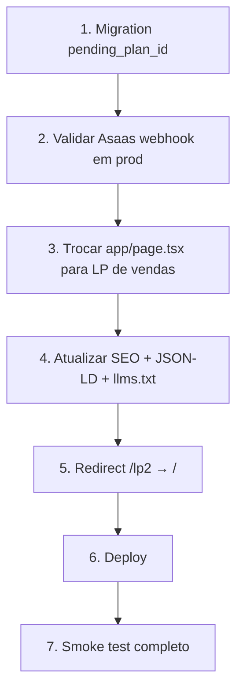

# Migração para modo vendas — Go-live

> Objetivo: trocar a home (`/`) do modo **pré-lançamento / waitlist** para o modo **vendas**, hoje validado em `/lp2`, e publicar o funil comercial de ponta a ponta.

---

## 1. Situação atual

| Rota | Modo | CTAs principais |
|------|------|-----------------|
| `/` | Pré-lançamento | WhatsApp, lista de fundadores, “lançamento em breve” |
| `/lp2` | Vendas | Checkout (`/checkout?plan=…`), assinar no hero e nos planos |
| `/checkout` | Comercial | Fluxo 3 passos + Asaas (cartão recorrente) |
| `/dashboard` | Pós-venda | Assinatura, entregas, upgrade, pausar/cancelar |

**O que já está pronto (não depende da migração da LP):**

- Checkout com Asaas em produção (`PAYMENT_PROVIDER=asaas`)
- Success page condicional (polling em `/api/checkout/status`)
- Pausar/retomar assinatura no Asaas (dashboard)
- Upgrade de plano agendado para o próximo ciclo (`pending_plan_id`)
- Pix removido do FAQ e das promessas de pagamento

**Gap principal:** visitantes em `/` ainda não entram no funil de venda.

---

## 2. Escopo da migração da LP

### 2.1 Trocar o conteúdo da home

**Arquivo:** `app/page.tsx`

Substituir os componentes de pré-lançamento pelos de vendas (espelho de `app/lp2/page.tsx`):

| Remover (Launch*) | Usar (vendas) |
|-------------------|---------------|
| `LaunchNavbar` | `Navbar` |
| `LaunchHero` | `Hero` |
| `LaunchMarquee` | `Marquee` |
| `LaunchProblem` / `LaunchSolution` | — (não existem na LP de vendas) |
| `LaunchPlans` | `PlansStack` |
| `LaunchSocialProof` / `LaunchCapture` | — |
| `LaunchFAQ` | `FAQ` |
| `LaunchFinalCTA` | — |
| `LaunchFooter` | `Footer` |

Remover dependências de waitlist na home:

- `getWaitlistCount()` (`lib/launch/waitlist.ts`)
- Props `waitlistCount` nos componentes Launch

**Metadados e JSON-LD na mesma PR:**

- Trocar `homePageMetadata` por copy de vendas (sem “lista de fundadores” / “entre antes do lançamento”)
- Trocar `buildHomeJsonLd()` para usar `faqItems` e `plans` de `lib/data.ts` (com `offers` nos produtos), como em `buildSalesPageJsonLd()`

Referência: `lib/seo/metadata.ts`, `lib/seo/structured-data.ts`

### 2.2 Rota `/lp2` após o go-live

Escolher **uma** opção (recomendado: redirect):

1. **Redirect 308/301** de `/lp2` → `/` (preserva links de teste e bookmarks)
2. **Remover** `app/lp2/page.tsx` e retornar 404

Implementação sugerida: `next.config` redirect ou `app/lp2/page.tsx` com `redirect('/')`.

### 2.3 SEO e indexação

| Arquivo | Ação |
|---------|------|
| `lib/seo/metadata.ts` | Atualizar `homePageMetadata` (description, OG, Twitter) para copy de vendas |
| `lib/seo/structured-data.ts` | Alinhar `buildHomeJsonLd()` com schema de vendas (`faqItems`, `plans`, `Offer`) |
| `app/robots.ts` | Remover `/lp2` de `disallow` após redirect; manter `disallow` em `/checkout`, `/dashboard`, `/api`, `/auth` |
| `app/sitemap.ts` | Confirmar `/` em `INDEXABLE_ROUTES` (`lib/seo/site.ts`) — já indexável |
| `app/llms.txt/route.ts` | Trocar `launchFaqItems` por `faqItems` de `lib/data.ts` |

**Copy a eliminar na home (metadados e corpo):**

- “Entre na lista de fundadores”
- “Entre antes do lançamento”
- “Vagas de fundador abertas”
- CTAs exclusivos para WhatsApp como ação principal de conversão

### 2.4 Navegação e CTAs

Conferir após a troca:

- `components/layout/Navbar.tsx` — CTA “Assinar” → `/checkout?plan=heroi` (ou dashboard se logado)
- `components/layout/Footer.tsx` — idem
- `components/sections/Hero.tsx` — CTA principal para checkout
- `components/sections/PlanPanel.tsx` — `checkoutHref(plan.id)` em cada plano

---

## 3. Pré-requisitos operacionais (antes ou junto do deploy)

### 3.1 Banco de dados

Aplicar migration pendente de upgrade:

```bash
supabase db push
# ou aplicar manualmente:
# supabase/migrations/20260616_subscription_pending_plan.sql
```

Coluna: `subscriptions.pending_plan_id` (upgrade agendado para o próximo ciclo).

### 3.2 Pagamentos (Asaas)

- [ ] `PAYMENT_PROVIDER=asaas` em produção
- [ ] `ASAAS_ENV=production` e chaves corretas no Vercel
- [ ] Webhook Asaas apontando para `https://<domínio>/api/webhooks/asaas`
- [ ] Eventos relevantes habilitados (pagamento confirmado / assinatura)

### 3.3 Variáveis e domínio

- [ ] `NEXT_PUBLIC_SITE_URL` (ou equivalente em `lib/email/config`) = domínio público final
- [ ] `shouldIndexSite()` retorna `true` em produção (não localhost, não preview Vercel)

---

## 4. Checklist de validação (smoke test)

Executar em **produção** ou staging espelhando produção:

### Funil comercial

- [ ] `/` exibe LP de vendas (não waitlist)
- [ ] Hero e planos levam ao checkout correto (`?plan=aventureiro|heroi|lendario`)
- [ ] Checkout completa: endereço → revisão → cartão Asaas
- [ ] `/checkout/success?ids=…` só mostra “Assinatura ativa” após confirmação do gateway
- [ ] Dashboard reflete assinatura `active` após webhook/sync

### Pós-venda

- [ ] Pausar assinatura → status `paused` local + `INACTIVE` no Asaas
- [ ] Retomar assinatura → status `active` + `nextDueDate` no Asaas
- [ ] Agendar upgrade (ex.: Aventureiro → Herói) → `pending_plan_id` preenchido
- [ ] Cancelar upgrade agendado → `pending_plan_id` limpo e valor revertido no Asaas

### SEO / rotas

- [ ] `/lp2` redireciona para `/` (se adotado redirect)
- [ ] `robots.txt` não bloqueia `/`
- [ ] Metadados da home sem linguagem de pré-lançamento
- [ ] JSON-LD válido (FAQ + planos com preço)

---

## 5. Itens opcionais pós-launch

Não bloqueiam a abertura de vendas, mas vale revisar depois:

| Item | Onde |
|------|------|
| E-mail de boas-vindas ainda menciona grupo WhatsApp de fundadores | `lib/email/templates/newsletter-welcome.ts` |
| Componentes `Launch*` e copy em `lib/launch/` | Manter arquivado ou remover em cleanup futuro |
| `docs/dungeonbox-lp-lancamento-copys.md` | Marcar como histórico de pré-lançamento |
| Homepage alternativa A/B | Nova rota ou feature flag, se necessário |

---

## 6. Ordem sugerida de execução



---

## 7. Definição de “pronto para vender”

Consideramos o go-live concluído quando:

1. A URL principal (`/`) converte para checkout (não waitlist).
2. Um pagamento real ou de teste em produção percorre checkout → success → dashboard sem intervenção manual.
3. Pausa e upgrade funcionam no painel com reflexo no Asaas.
4. SEO público descreve produto à venda, sem promessa de “em breve”.

---

## 8. Referências no código

| Assunto | Caminho |
|---------|---------|
| Home atual (pré-lançamento) | `app/page.tsx` |
| LP de vendas (referência) | `app/lp2/page.tsx` |
| Metadados | `lib/seo/metadata.ts` |
| Schema.org | `lib/seo/structured-data.ts` |
| Robots / sitemap | `app/robots.ts`, `app/sitemap.ts` |
| FAQ vendas | `lib/data.ts` → `faqItems` |
| FAQ pré-lançamento | `lib/launch/data.ts` → `launchFaqItems` |
| Checkout | `app/checkout/`, `components/checkout/` |
| Pagamentos | `lib/payments/provider.ts`, `app/api/asaas/` |
